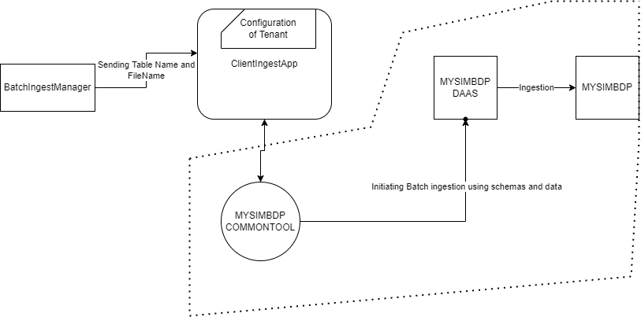
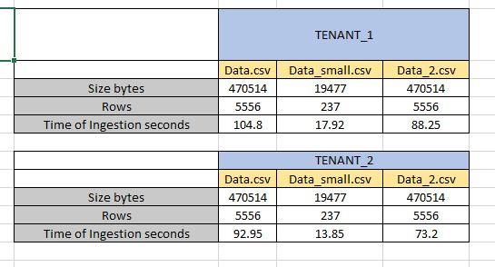

## Part 1 - Batch data ingestion

1. *The ingestion will be applied to files of data. Design a set of constraints for files that mysimbdp will support for ingestion.
Design a set of constraints for the tenant service profile w.r.t. ingestion (e.g., maximum number of files and amount of data).
Explain why you as a platform provider decide such constraints. Implement these constraints into simple configuration files
and provide examples (e.g., JSON or YAML).* 
    
    Since we will have many tenants, I have designed constraints to be individual for every tenant so that we can limit accesses and control everything easily. I have decided to use 1 constraint_ingestion.JSON file which will contain all the tenant's constraints according to their unique tenant_id. There are many constraints that we can put but for ease of implementation I decided to use following constraints set:


    ```javascript
    [
        {
            "valid_file_format": "csv",
            "max_batch_size_rows" : 200,
            "max_file_size_MB": 20,
            "tenant_id": "tenant_1",
            "max_file_number": 4,
            "consistency" : 1
        },
        {
            
            "valid_file_format": "csv",
            "max_batch_size_rows": 200,
            "max_file_size_MB": 20,
            "tenant_id": "tenant_2",
            "max_file_number": 4,
            "consistency" : 1
        }
    ]
    ```  
    * valid_file_format -> The file formats that can be used as a valid input
    * max_batch__size_rows -> we can limit batch sizes  according to our platform's possibilities and also tenant's access level
    * max_file_size_MB -> We can limit maximum file size that can be used as an input 
    * tenant_id -> this field is to identify tenants according to their unique id's. 
    * max_file_number -> We can limit number of files that tenant can have
    * consistency -> We can configure consistency level for individual tenants (1: Quroum , 2: ALL)
  
   
2. *Each tenant will put the tenant's data files to be ingested into a directory, client-staging-input-directory within mysimbdp.
Each tenant provides ingestion programs/pipelines, clientbatchingestapp, which will take the tenant's files as input, in
client-staging-input-directory, and ingest the files into mysimbdp-coredms. Any clientbatchingestapp must perform at
least one type of data wrangling. As a tenant, explain the design of clientbatchingestapp and provide one implementation.
Note that clientbatchingestapp follows the guideline of mysimbdp given in the next Point 3.* 

    We will havbe many tenants and they will have many tables so in order to ease managing table schemas for the platform then tenant itself provides its configuration inside their clientbatchingestapp. for example: 


    ```javascript
    {
    "tenant_id": "tenant_1",
    "tables": [
        {
            "table_name": "listings",
            "primary_key": ["host_id", "id"],
            "schema": [
                {"field": "id", "type": "int"},
                {"field": "host_id", "type": "int"},
                {"field": "host_name", "type": "text"},
                {"field": "neighbourhood", "type": "text"},
                {"field": "latitude", "type": "float"},
                {"field": "longitude", "type": "float"},
                {"field": "room_type", "type": "text"},
                {"field": "price", "type": "int"},
                {"field": "availability_365", "type": "int"}
            ]
        },
        {
            "table_name": "Listing_table_2",
            "primary_key": ["host_id", "id"],
            "schema": [
                {"field": "id", "type": "int"},
                {"field": "host_id", "type": "int"},
                {"field": "host_name", "type": "text"},
                {"field": "neighbourhood", "type": "text"},
                {"field": "latitude", "type": "float"},
                {"field": "longitude", "type": "float"},
                {"field": "room_type", "type": "text"},
                {"field": "price", "type": "int"},
                {"field": "availability_365", "type": "int"}
            ]
        }
    ]
    }          
     ```  

    I have designed a common tool that will be provided to each tenant and they can import it in their clientingestapp.  This CommonTool accesses to tenant configuration and also gets the source_endpoint (source file to be ingested and table in the DB that data should be ingested) . It performs constraint compliances and handles everything to DAAS API to ingest the data. Thus clientingestapp provides tenant's configuration and source_endpoint to initiate the ingestion process.

    

   


3. *As the mysimbdp provider, design and implement a component mysimbdp-batchingestmanager that invokes tenant's
clientbatchingestapp to perform the ingestion for available files in client-staging-input-directory. mysimbdp imposes the
model that clientbatchingestapp has to follow but clientbatchingestapp is, in principle, a blackbox to mysimbdpbatchingestmanager. Explain how mysimbdp-batchingestmanager decides/schedules the execution of
clientbatchingestapp for tenants.* 

    I have decided to use file/directory kind of system for my tenant's input datas. Every tenant has a unique id so inside client-staging-input-directory there is a folder for each tenant whose name is tenant's id. Since tenants can have multiple tables, the folders inside tenant folder shows the tables. Each folder's name is table's name. Tenant puts it's input file inside this table folders to start the ingestion. THis way whenever the file is moved to the table folder we perform ingestion to that tenant's specific table.

    I have implemented it using Watchdog python module. Batchingestmanager monitors the client-staging-input-directory and whenever it detects a new file first it checks the constraints compliance (since we have constraints JSON file) and if everything is good then it proceeds to execute appropriate tenant's clientingestapp with arguments of the table name and file source. it gets these arguments from folder's names that new file has been moved to. This way the implementation and overall execution becomes very simple.


4. *Explain your design for the multi-tenancy model in mysimbdp: which parts of mysimbdp will be shared for all tenants,
which parts will be dedicated for individual tenants so that you as a platform provider can add and remove tenants based on
the principle of pay-per-use. Develop test programs (clientbatchingestapp), test data, and test constraints of files, and test
service profiles for tenants according your deployment. Show the performance of ingestion tests, including failures and
exceptions, for at least 2 different tenants in your test environment and constraints. What is the maximum amount of data
per second you can ingest in your tests?*
 
    From tools  I have chosen to share the CommonTool which takes care of connection with DAAS and handles the configuration from clientingestapps. My databse will be shared between tenants. Since I am using Cassandra DB I can use Keyspaces for isolatig the different tenant's data and tables this allows perfect way to handle them differently but at the same time using the same database. I have chosen to create Keyspace with name of tenant_id  to be able to differentiate them easily easily. It also helps with configuration part since in input directory the root folder will be <tenant_id> folder so it will preserve the file/directory tree system that I was using for input files and tables.


    


* Test Implementation

    I have implemented everything as designed and answered to previous questions. I have chosen same data schema for both tenants to ease the implementation. First we run docker compose to create 3 nodes of cassandra . then we run our Flask api mysimbdp_daas.py . Then we start our batchingestmanager.py which starts to monitor the input folder as soon as it notices new file in any of folders it checks compliance , then runs the appropriate client's ingest app. I have created following tables and configured them in clientingest apps :
     
     * tenant_1 has tables named : listings , Listing_table_2. 
     * tenant_2 has tables named : another_listing , New_table_2

    I have tested with 3 data files one is 5556 rows and the other is 237 rows. 3rd one called data_2 is copy of 1st one.
    The results are :

     

     According to our test maximum speed i got was 5062 bytes/second. This is because my local implementation limits. We can speed it up by increasing batch rows size from 200. Because of my local implementation this was the max batch size I could put. We could almost double the speed if we could ingest using more than 300 rows of batch size.


5. *Implement and provide logging features for capturing successful/failed ingestion as well as metrics about ingestion time,
data size, etc., for files which have been ingested into mysimbdp. Logging information must be stored in separate files,
databases or a monitoring system for analytics of ingestion. Show and explain simple statistical data extracted from logs for
individual tenants and for the whole platform with your tests.* 

    I have used the logging module of python to provide logging features. I used it mainly inside the common tool since that's where most of action is going on and I also use it in batchingestmanager because it is the first point of interaction with inputs. I have one logs.log file where overall all logs about system goes and then I have <tenant_id>logs.log where logs of specific tenants go.  
    Example of logs.log :

        INFO:BatchIngestManagerLogger:Started Batch Ingest Manager
        INFO:BatchIngestManagerLogger:New file detected: tenant_1/Listing_table_2/data_small.csv
        INFO:MYSIMBDP Logger:Started MYSIMBDP Logger
        INFO:tenant_1Logger::Tenant Common tool initiated
        INFO:MYSIMBDP Logger:Creating the table for  tenant_id=tenant_1, file_name=data_small.csv, table_name=Listing_table_2
        INFO:tenant_1Logger::Creating the table for  tenant_id=tenant_1, file_name=data_small.csv, table_name=Listing_table_2
        INFO:MYSIMBDP Logger:Starting batch Ingest
        INFO:tenant_1Logger::Starting batch Ingest
        INFO:MYSIMBDP Logger:Finished the ingestion 
        status=success, tenant_id=tenant_1, file_name=data_small.csv, file_size_bytes=19477, table_name=Listing_table_2, ingestion_rows=237, total_time_cost=5.690535545349121 seconds
        INFO:tenant_1Logger::Finished the ingestion 
        status=success, tenant_id=tenant_1, file_name=data_small.csv, file_size_bytes=19477, table_name=Listing_table_2, ingestion_rows=237, total_time_cost=5.690535545349121 seconds
        INFO:BatchIngestManagerLogger:New file detected: tenant_1/listings/data_small.csv
        INFO:MYSIMBDP Logger:Started MYSIMBDP Logger
        INFO:tenant_1Logger::Tenant Common tool initiated
        INFO:MYSIMBDP Logger:Creating the table for  tenant_id=tenant_1, file_name=data_small.csv, table_name=listings
        INFO:tenant_1Logger::Creating the table for  tenant_id=tenant_1, file_name=data_small.csv, table_name=listings
        INFO:MYSIMBDP Logger:Starting batch Ingest
        INFO:tenant_1Logger::Starting batch Ingest
        INFO:MYSIMBDP Logger:Finished the ingestion 
        status=success, tenant_id=tenant_1, file_name=data_small.csv, file_size_bytes=19477, table_name=listings, ingestion_rows=237, total_time_cost=7.287861585617065 seconds
        INFO:tenant_1Logger::Finished the ingestion 
        status=success, tenant_id=tenant_1, file_name=data_small.csv, file_size_bytes=19477, table_name=listings, ingestion_rows=237, total_time_cost=7.287861585617065 seconds
        INFO:BatchIngestManagerLogger:New file detected: tenant_2/another_listing/data_small.csv

    Example of tenant_1logs.log:

            Tenant Common tool initiated
            Creating the table for  tenant_id=tenant_1, file_name=data_small.csv, table_name=Listing_table_2
            Starting batch Ingest
            Finished the ingestion 
            status=success, tenant_id=tenant_1, file_name=data_small.csv, file_size_bytes=19477, table_name=Listing_table_2, ingestion_rows=237, total_time_cost=5.690535545349121 seconds
            Tenant Common tool initiated
            Creating the table for  tenant_id=tenant_1, file_name=data_small.csv, table_name=listings
            Starting batch Ingest
            Finished the ingestion 
            status=success, tenant_id=tenant_1, file_name=data_small.csv, file_size_bytes=19477, table_name=listings, ingestion_rows=237, total_time_cost=7.287861585617065 seconds
            Tenant Common tool initiated
            Creating the table for  tenant_id=tenant_1, file_name=data.csv, table_name=Listing_table_2
            Starting batch Ingest
            Finished the ingestion 
            status=success, tenant_id=tenant_1, file_name=data.csv, file_size_bytes=470514, table_name=Listing_table_2, ingestion_rows=5556, total_time_cost=60.319260120391846 seconds
            Tenant Common tool initiated
            Creating the table for  tenant_id=tenant_1, file_name=data.csv, table_name=listings
            Starting batch Ingest
            Finished the ingestion 
            status=success, tenant_id=tenant_1, file_name=data.csv, file_size_bytes=470514, table_name=listings, ingestion_rows=5556, total_time_cost=68.4549822807312 seconds

    Logs contain creation of new tables, new input data files, Ingestion results and some statistics about ingestion.


## Part 2 - Near-realtime data ingestion


1. *Tenants will put their data into messages and send the messages to a messaging system, mysimbdp-messagingsystem
(provisioned by mysimbdp) and tenants will develop ingestion programs, clientstreamingestapp, which read data from the
messaging system and ingest the data into mysimbdp-coredms. For near-realtime ingestion, explain your design for the
multi-tenancy model in mysimbdp: which parts of the mysimbdp will be shared for all tenants, which parts will be dedicated
for individual tenants so that mysimbdp can add and remove tenants based on the principle of pay-per-use. Design and
explain a set of constraints for the tenant service profile w.r.t. data ingestion.* 

2. *Design and implement a component mysimbdp-streamingestmanager, which can start and stop clientstreamingestapp
instances on-demand. mysimbdp imposes the model that clientstreamingestapp has to follow so that mysimbdpstreamingestmanager can invoke clientstreamingestapp as a blackbox, explain the model.* 

3. *Develop test ingestion programs (clientstreamingestapp), test data, and test service profiles for tenants. Show the
performance of ingestion tests, including failures and exceptions, for at least 2 different tenants in your test environment.
What is the maximum throughput of the ingestion in your tests?*
4. *clientstreamingestapp decides to report the its processing rate, including average ingestion time, total ingestion data size,
and number of messages to mysimbdp-streamingestmonitor within a pre-defined period of time. Design the report format
and explain possible components, flows and the mechanism for reporting.* 

5. *Implement a feature in mysimbdp-streamingestmonitor to receive the report from clientstreamingestapp. Based on the
report from clientstreamingestapp and the tenant profile, when the performance is below a threshold, e.g., average
ingestion time is too low, mysimbdp-streamingestmonitor decides to inform mysimbdp-streamingestmanager about the
situation. Implementation a feature in mysimbdp-streamingestmanager to receive information informed by mysimbdpstreamingestmonitor.*

## Part 3 - Integration and Extension


1. *Produce an integrated architecture for the logging and monitoring of both batch and near-realtime ingestion features (Part 1,
Point 5 and Part 2, Points 4-5) so that you as a platform provider could know the amount of data ingested and existing
errors/performance for individual tenants.* 
2. *In the stream ingestion pipeline, assume that a tenant has to ingest the same data but to different sinks, e.g., mybdpcoredms for storage and a new mybdp-streamdataprocessing component, what features/solutions you can provide and
recommend to your tenant?*
3. *The tenant wants to protect the data during the ingestion using some encryption mechanisms, e.g., clientbatchingestapp
and clientstreamingestapp have to deal with encrypted data. Which features/solutions you recommend the tenants and
which services you might support them for this goal?*

4. *In the case of batch ingestion, we want to (i) detect the quality of data to allow ingestion only for data with a pre-defined
quality of data condition and (ii) store metadata, including detected quality, into the platform, how you, as a platform provider,
and your tenants can work together?*
5. *If a tenant has multiple clientbatchingestapp and clientstreamingestapp, each is suitable for a type of data and has
different workloads (e.g., different CPUs, memory consumption and execution time), how would you extend your design and
implementation in Parts 1 & 2 (only explain the concept/design) to support this requirement?*

| ID      | HostId | Host_name      | neighbourhood | Latitude      | Longitude | Room_type      | Price | Availability_365  | 
| ----------- | ----------- | ----------- | ----------- | ----------- | ----------- | ----------- | ----------- | ----------- |
| Listing Id -  Integer      |  Integer    |text    | text    | float    | Float    |  text    | Integer    |Availability - Integer   |

