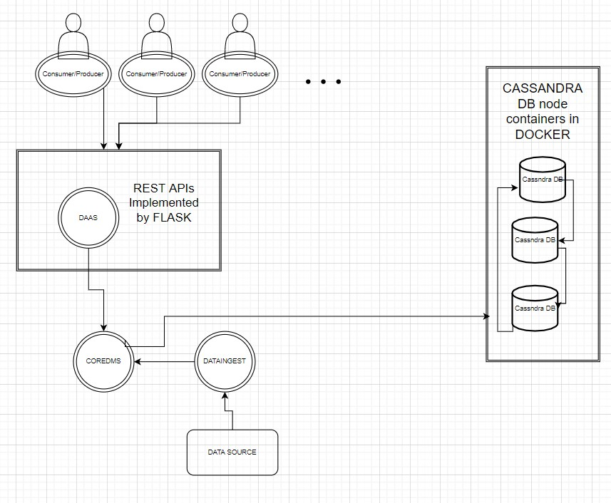

# Jeyhun Yagublu Assignment Report

## Part 1 - Design

1. *Explain your choice of types of data to be supported and technologies for*  ***mysimbdp-coredms***
    

    I have decided to use Airbnb Listings data for my design since it can include huge amount of data and airbnb is one of the widely used platforms which needs to use their data efficiently. This data is a tabular data consisting different types of data (numerical,textual etc) as its columns and can span to billions of rows. 
    
    I have decided to use Cassandra as my data storage given its capabilities and successful implementations on similar big data platforms. It is scalable and  can reliable work even when there are failures in some components. Moreover it can reliable work under heavy load when multiple Consumers and Producers need it concurrently. I will use cassandra containers in Docker to implement all needed functionality.

    I decided to implement cassandra setup and configuration using Python and this setup can be accessed using REST API through Python FLASK.

2. *Design and explain interactions between main components in your architecture of mysimbdp*

  
    

    For this purpose I will have 3 nodes of cassandra which will be docker containers. Main coredms component will take care of communication between databases and every other APIs and components. DAAS component will take care of traffic from Prodducers/Consumers that will communicate to it through REST APIs  implemented by FLASK and dataingest component will communicate to database through  COREDMS component .

3. *Explain a configuration of a cluster of nodes for mysimbdp-coredms so that you prevent a single-point-of-failure problem for mysimbdp-coredms for your tenants* 

    I have used replication factor of 3  while configuring Cassandra nodes so even if 2 nodes would fail for some reason, we would still have at least 1 replica in another node since replicas are stored in different nodes thus database would work as it should without any interruption. In Cassandra there is no main node and all nodes work in peer-to-peer way so no node failure would cause any problem for us while at least 1 node is working.

4. *You decide a pre-defined level of data replication for your tenants/customers. Explain how many nodes are needed in the deployment of mysimbdp-coredms for your choice so that this component can work property (e.g., the system still supports redundancy in the case of a failure of a node)*

    Since I have defined replication factor of 3 then I should at least have  3 nodes in my deployment since replicas are stored in different nodes so I need to have nodes greater or equal than my replication factor.

5. *Explain how would you scale mysimbdp to allow many tenants using mysimbdp-dataingest to push data into mysimbdp*

    It is possible to scale my mysimbdp to allow many tenants in variety of ways. First of all we can scale DAAS using concurrent Docker containers to provide better load handling to serve many tenants. Moreover we can scale up Cassandra clusters and provide more nodes thus increasing our max replication factor capacity which would provide increased performance while handling big traffic from many tenants.

## Part 2 - Implementation 
### Address the following points

1. *Design, implement and explain one example of the data schema/structure for a tenant whose data will be stored into
mysimbdp-coredms*

    I have decided to use Airbnb listings data. In my implementation it consists of 9 columns as its schema will be illustrated below and I have multiple versions of this data with different number of rows ranging from 5500 to 23000000 rows and its size is ranging between 0.5mb  up to 2 GB.

| ID      | HostId | Host_name      | neighbourhood | Latitude      | Longitude | Room_type      | Price | Availability_365  | 
| ----------- | ----------- | ----------- | ----------- | ----------- | ----------- | ----------- | ----------- | ----------- |
| Listing Id -  Integer      |  Integer    |text    | text    | float    | Float    |  text    | Integer    |Availability - Integer   |

In this data schema Listing ID can be used as primary key as it is unique for the listing.

2. *Given the data schema/structure of the tenant (Part 2, Point 1), design a strategy for data partitioning/sharding and explain your implementation for data partitioning/sharding together with your design for replication in Part 1, Point 4, in mysimbdpcoredms*

In Cassandra partitioning goes related to primary keys. Listings have unique id but one Host can have many listings so it is better to partition it by host_id s  one another proposal could be to partition data related to the neigbourhoods. I will go with first choice.

3. *Assume that you are the tenant, write a mysimbdp-dataingest that takes data from your selected sources and stores the data into mysimbdp-coredms. Explain possible consistency options for writing data in your mysimdbp-dataingest*

    I have python script called dataingest.py. It takes as arguments table name , datafile source and consistency (ONE, ALL, default is QUORUM ). Default option for consistency is QUORUM and in that case as our replication factor is 3 then write will have to be committed to at least 2 nodes. in case of ONE then write has to be made to at least 1 node and ALL means it has to be written to ALL nodes.
    Script is used as :

        python3 dataingest.py <Table_name> <file source> <Consistency (QUORUM is default if left blank)>

    Example:

        python3 dataingest.py listings ../data/data_BIG.csv 
        python3 dataingest.py listings ../data/data_BIG.csv ALL

4. *Given your deployment environment, show the performance (response time and failure) of the tests for 1,5, 10, .., n of concurrent mysimbdp-dataingest writing data into mysimbdp-coredms with different speeds/velocities together with the change of the number of nodes of mysimbdp-coredms .Indicate any performance differences due to the choice of consistency options*

5. *Observing the performance and failure problems when you push a lot of data into mysimbdp-coredms (you do not need to worry about duplicated data in mysimbdp), propose the change of your deployment to avoid such problems (or explain why you do not have any problem with your deployment)*

Part 3 Extension (weighted factor for grades = 1)
Address the following points:
1. Using your mysimdbp-coredms, a single tenant can create many different databases/datasets. Assume that you want to
support the tenant to manage metadata about the databases/datasets, what would be your solution? (1 point)
2. Assume that each of your tenants/users will need a dedicated mysimbdp-coredms. Design the data schema of service
information for mysimbdp-coredms that can be published into an existing registry (like ZooKeeper, consul or etcd) so that
you can find information about which mysimbdp-coredms is for which tenants/users (1 point)
3. Explain how you would change the implementation of mysimbdp-dataingest (in Part 2) to integrate a service discovery
feature (no implementation is required) (1 point)
4. Assume that now only mysimbdp-daas can read and write data into mysimbdp-coredms, how would you change your
mysimbdp-dataingest (in Part 2) to work with mysimbdp-daas? (1 point)
5. Assume that you design APIs for mysimbdp-daas so that any other developer who wants to implement mysimbdpdataingest can write his/her own ingestion program to write the data into mysimbdp-coredms by calling mysimbdp-daas.
Explain how would you control the data volume and speed in writing and reading operations for a tenant? (1 point)
You will address the above-mentioned points by writing them into the design document (template: Assignment-1-
Report.md, see the git assignment template) and provide source files.
Using the template: Assignment-1-Deployment.md (see the git assignment template) for describing how to run/deploy
your code, whereas code/scripts and logs will be organized into appropriate directories.
4 Other notes
Remember that we need to reproduce your work. Thus:
Remember to include the (adapted) deployment scripts/code you used for your installation/deployment
Explain steps that one can follow in doing the deployment (e.g. using which version of which databases)
Include logs to show successful or failed tests/deployments
Include git logs to show that you have incrementally solved questions in the assignment
etc.
You can check some hints of how to succeed in big data platforms assignments