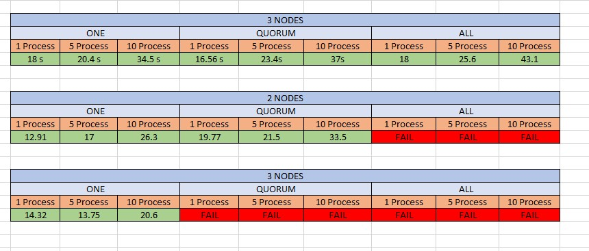

# Jeyhun Yagublu Assignment Report

## Part 1 - Batch data ingestion

1. *The ingestion will be applied to files of data. Design a set of constraints for files that mysimbdp will support for ingestion.
Design a set of constraints for the tenant service profile w.r.t. ingestion (e.g., maximum number of files and amount of data).
Explain why you as a platform provider decide such constraints. Implement these constraints into simple configuration files
and provide examples (e.g., JSON or YAML).* 
    

   

   

1. *Design and explain interactions between main components in your architecture of mysimbdp*

  
    

    For this purpose I will have 3 nodes of cassandra which will be docker containers. Main coredms component will take care of communication between databases and every other APIs and components. DAAS component will take care of traffic from Prodducers/Consumers that will communicate to it through REST APIs  implemented by FLASK and dataingest component will communicate to database through  COREDMS component .

2. *Explain a configuration of a cluster of nodes for mysimbdp-coredms so that you prevent a single-point-of-failure problem for mysimbdp-coredms for your tenants* 

    I have used replication factor of 3  while configuring Cassandra nodes so even if 2 nodes would fail for some reason, we would still have at least 1 replica in another node since replicas are stored in different nodes thus database would work as it should without any interruption. In Cassandra there is no main node and all nodes work in peer-to-peer way so no node failure would cause any problem for us while at least 1 node is working.

3. *You decide a pre-defined level of data replication for your tenants/customers. Explain how many nodes are needed in the deployment of mysimbdp-coredms for your choice so that this component can work property (e.g., the system still supports redundancy in the case of a failure of a node)*

    Since I have defined replication factor of 3 then I should at least have  3 nodes in my deployment since replicas are stored in different nodes so I need to have nodes greater or equal than my replication factor.

4. *Explain how would you scale mysimbdp to allow many tenants using mysimbdp-dataingest to push data into mysimbdp*

    It is possible to scale my mysimbdp to allow many tenants in variety of ways. First of all we can scale DAAS using concurrent Docker containers to provide better load handling to serve many tenants. Moreover we can scale up Cassandra clusters and provide more nodes thus increasing our max replication factor capacity which would provide increased performance while handling big traffic from many tenants.

## Part 2 - Implementation 
### Address the following points

1. *Design, implement and explain one example of the data schema/structure for a tenant whose data will be stored into
mysimbdp-coredms*

    I have decided to use Airbnb listings data. In my implementation it consists of 9 columns as its schema will be illustrated below and I have multiple versions of this data with different number of rows ranging from 5500 to 23000000 rows and its size is ranging between 0.5mb  up to 2 GB.

| ID      | HostId | Host_name      | neighbourhood | Latitude      | Longitude | Room_type      | Price | Availability_365  | 
| ----------- | ----------- | ----------- | ----------- | ----------- | ----------- | ----------- | ----------- | ----------- |
| Listing Id -  Integer      |  Integer    |text    | text    | float    | Float    |  text    | Integer    |Availability - Integer   |

In this data schema Listing ID can be used as primary key as it is unique for the listing.

2. *Given the data schema/structure of the tenant (Part 2, Point 1), design a strategy for data partitioning/sharding and explain your implementation for data partitioning/sharding together with your design for replication in Part 1, Point 4, in mysimbdpcoredms*

In Cassandra partitioning goes related to primary keys. Listings have unique id but one Host can have many listings so it is better to partition it by host_id s  one another proposal could be to partition data related to the neigbourhoods. I will go with first choice.

3. *Assume that you are the tenant, write a mysimbdp-dataingest that takes data from your selected sources and stores the data into mysimbdp-coredms. Explain possible consistency options for writing data in your mysimdbp-dataingest*

    I have python script called dataingest.py. It takes as arguments  datafile source and consistency (ONE, ALL, QUORUM ). Default option for consistency is QUORUM and in that case as our replication factor is 3 then write will have to be committed to at least 2 nodes. in case of ONE then write has to be made to at least 1 node and ALL means it has to be written to ALL nodes.
    Script is used as :

        python3 dataingest.py  <file source> <Consistency>

    Example:

        python3 dataingest.py ../data/data_BIG.csv QUORUM
        python3 dataingest.py ../data/data_BIG.csv ALL

4. *Given your deployment environment, show the performance (response time and failure) of the tests for 1,5, 10, .., n of concurrent mysimbdp-dataingest writing data into mysimbdp-coredms with different speeds/velocities together with the change of the number of nodes of mysimbdp-coredms .Indicate any performance differences due to the choice of consistency options*
 
    I have tried first 5000 rrows of data which was 0.5 MB with different number of nodes and different number of concurrent processes. The time performance is average time for data ingestion when n number of concurrent ingest processes work:

    

    Failures occur because of chosen consistency. For our design QUORUM needs at least 2 replicas and ALL needs 3 replicas. If there aren't enough nodes working properly then data ingestion fails as expected. Solution  would be to add new nodes.

5. *Observing the performance and failure problems when you push a lot of data into mysimbdp-coredms (you do not need to worry about duplicated data in mysimbdp), propose the change of your deployment to avoid such problems (or explain why you do not have any problem with your deployment)*

    I have pushed 200000 rows of data which is 20MB with 3 nodes. First I have encountered problem with QUORUM and ALL consistency because my heap size for cassandra containers was not enough for such big data. Solution was to allocate more RAM of my machine to cassandra containers and only after that I was able to push all my data into mysimbdp. Additionally I have noticed that before increasing hheap size my ingest function took **671.28s** to push data with consistency of ONE while after increasing the allocated memory my ingestion with same consistency level took only **454.58 s**. In the start I have allocated new heap size of 1 M and max heap size of 512M but I have increased them to 40M and 1024 M accordingly.  Below is resulsts of experiment:

    
    

## Part 3 Extension 
  ### Address the following points:

1. *Using your mysimdbp-coredms, a single tenant can create many different databases/datasets. Assume that you want to support the tenant to manage metadata about the databases/datasets, what would be your solution?* 

    Since our tenants uses mysimbdp-coredms by connecting to DAAS APIs then one solution would be to extend its functionality to allow tenant perform different queries to manage metadata about his databases. We could store information about each database that tenant owns so that we can perform checks and allow/forbid database management if tenant doesn't own it. We could create another component which only takes care of this access management.

2. *Assume that each of your tenants/users will need a dedicated mysimbdp-coredms. Design the data schema of service information for mysimbdp-coredms that can be published into an existing registry (like ZooKeeper, consul or etcd) so that you can find information about which mysimbdp-coredms is for which tenants/users*

    ZooKeeper is a centralized service for maintaining configuration information, naming, providing distributed synchronization, and providing group services. All of these kinds of services are used in some form or another by distributed applications.

    My simple data schema would be following:

    | ID  | TenantID    | TenantName | IP | Port |  
    | ----------- |  ----------- |   ----------- |   ----------- |   ----------- | 
    | UUID  | UUID | TenantName | text | integer | 

3. *Explain how you would change the implementation of mysimbdp-dataingest (in Part 2) to integrate a service discovery feature (no implementation is required)*

    Service Discovery has the ability to locate a network automatically making it so that there is no need for a long configuration set up process. Service discovery works by devices connecting through a common language on the network allowing devices or services to connect without any manual intervention.

    There are three components to Service Discovery: the service provider, the service consumer and the service registry.
   1) The Service Provider registers itself with the service registry when it enters the system and de-registers itself when it leaves the system.

   2) The Service Consumer gets the location of a provider from the service registry, and then connects it to the service provider.

   3) The Service Registry is a database that contains the network locations of service instances. The service registry needs to be highly available and up to date so clients can go through network locations obtained from the service registry. A service registry consists of a cluster of servers that use a replication protocol to maintain consistency. 

    Thus we could use ApacheZookepper or other registries in similar way to previous question's answer so that dataingest and other components register themselves in the registry and share information about them.

4. *Assume that now only mysimbdp-daas can read and write data into mysimbdp-coredms, how would you change your mysimbdp-dataingest (in Part 2) to work with mysimbdp-daas?* 

    We should change data ingest in such a way that it doesnt perform write operation itself but rather communicates to DAAS through one of its APIs to provide data that is needed to be written to mysimbdp-coredms. Inn this case data ingest would only get the data from source, perform some operations on it to prepare data for DAAS API and then send it for DAAS to perform the write operation.

5. *Assume that you design APIs for mysimbdp-daas so that any other developer who wants to implement mysimbdpdataingest can write his/her own ingestion program to write the data into mysimbdp-coredms by calling mysimbdp-daas. Explain how would you control the data volume and speed in writing and reading operations for a tenant?*

    Since our DAAS will take care of write and read operations then we could control the batch sizes, speed of writing etc directly in DAAS itself and we could store all limitations depending on specific tenant in a registry.
